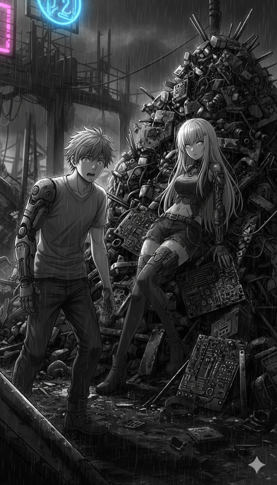
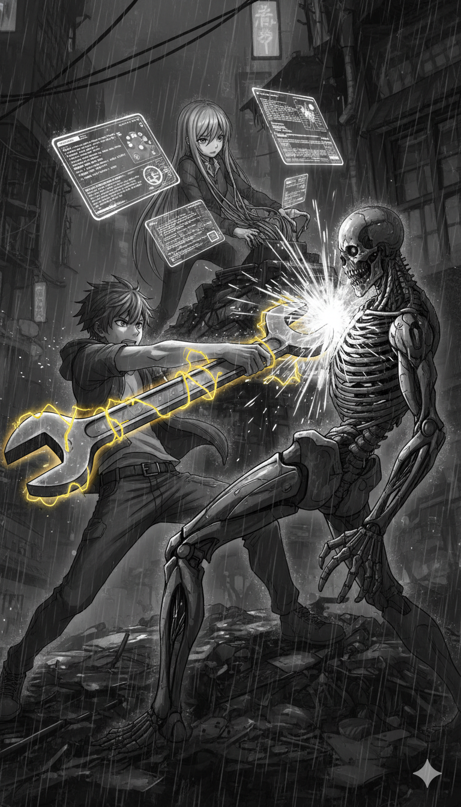

Scene 1: The Scrapyard Encounter

The ruins of "The Mint" Tower looked like a skeletal ribcage against the toxic violet sky of Neo-Jakarta. Rain hissed against Rix’s worn-out jacket, a cheap imitation of the one the legend Kai once wore before he triggered the "Great Default" five years ago. He adjusted the settings on his salvage-yard Sandevistan, feeling the familiar, painful spark of faulty circuitry against his spine. Every breath in the sprawl tasted of burnt ozone and rotting data, a constant reminder of a city that had effectively defaulted on its own existence.

Rix swung his modified wrench—an oversized piece of scrap metal fused with a stuttering electric coil—to pry open a rusted server rack. He wasn't just looking for copper or processors; he was looking for the chip, the one rumored to hold the key to the phantom equity Kai had left in the digital vacuum of the "wetvacuum". In this era, physical currency was a myth, replaced by the glowing blue liquid of Bio-Time vials embedded in the forearms of the living. To run out of Bio-Time was to flatline, triggering a "Final Liquidation" where even your corpse became corporate property.

"Looking for a ghost, scavenger?" a sharp, cynical voice cut through the mechanical hum of the rain.

Rix spun around, raising his wrench as his HUD flickered with threat warnings. Crouched behind a stack of fried circuit boards was a woman who looked like she had fallen from a high-rise balcony.

Her silver data ports glinted in the nape of her neck, and her eyes flickered with the red text of a military-grade Cyberdeck. This was Vera, an ex-Corpo whose status had likely been revoked when her assets failed to cover her interest rates.

"You're making enough noise to wake the dead," she whispered, her fingers transforming into slender interface cables as she tapped into a nearby terminal.

"The dead already have jobs in this city, Brody," Rix retorted, using the street-slang of the debt-ridden slums. He knew the terrifying reality of Project Lazarus: Sovereign Corp no longer sent threatening messages or used "Sebar Data" tactics to shame the living. Instead, they used AI to resurrect deceased debtors as Revenants—cyborg slave soldiers whose brains were repurposed to pay off their outstanding balances.

Suddenly, a heavy thud echoed from the levels above, followed by the sound of sixty missed calls vibrating through the scrapyard's local mesh network. A red laser sight swept across the scrap metal, pausing briefly on Rix’s chest.

"Too late," Vera hissed, her fingers flying across a holographic interface. "The Revenants are here to collect, and they don't accept apologies or Maqashid philosophy as payment.".

A squad of grey-skinned cyborgs dropped from the rafters, their movements jerky yet terrifyingly efficient. They were the physical embodiment of the "Riba" that had once destroyed Neo-Jakarta—a debt that scaled faster than death itself. Rix tightened his grip on his wrench, the electric coil humming with a lethal, unstable blue light.

"I'm not going to become an asset for Sovereign Corp today," Rix growled, his Sandevistan sparking as he prepared to override his biological safety limits.

"Then move, scavenger!" Vera shouted, her Cyberdeck finally breaking the encryption on the scrapyard's gate. "I’ve hacked their optical sensors, but it’ll only give us five minutes—the same amount of time they used to promise for an instant loan before the world ended.".

Rix didn't need to be told twice. He lunged forward into the dark, the world slowing down as his junk-chrome kicked into gear, ready to fight the ghosts of a system that refused to let the city rest in peace.

The toxic violet rain of Neo-Jakarta sizzled against Rix’s overheated Sandevistan as he pushed the junk-chrome past its safety limits. In his vision, the world stretched and blurred into a smear of neon pink and oily black. The jerky movements of the Revenants slowed down to a crawl, their cybernetic limbs wheezing with the sound of hydraulic fluid that mimicked a dying man’s breath.

"Rix, the Ice-Breaker is struggling! Their neural mesh is industrial-grade!" Vera’s voice crackled in his internal comms, distorted by the static of the scrapyard’s failing shield.

He didn't answer. He couldn't. The "junk-chrome" against his spine sparked, sending a jolt of white-hot agony through his nerves—a biological penalty for a debt his body couldn't afford to pay. He swung the modified wrench, the electric coil screaming as it connected with the lead Revenant’s neck. Instead of a mechanical spark, a spray of grey, synthetic blood hit Rix’s visor.

Through the crack in the enemy's armor, Rix saw it: a tattooed serial number on a piece of rotting human skin. These weren't just machines; they were the "Recalled Assets" of Sovereign Corp, debtors whose lives had been seized under the Final Liquidation protocol.

"Four minutes left, Brody! Stop playing hero and clear the path!" Vera shouted, her fingers moving like silver spiders over her Cyberdeck. She wasn't just watching the fight; she was fighting a digital war in the "wetvacuum", the legal and data vacuum where Sovereign Corp hid its illegal algorithms.

Rix pivoted, his boots skidding on a pile of discarded Bio-Time vials. He felt the "Mortal Interest" of the Sandevistan usage—a heavy, sinking feeling in his chest that reminded him his own Bio-Time was ticking down with every overclocked second. He slammed his wrench into the ground, discharging the remaining energy in a radial burst. The EMP-like shockwave sent the Revenants into a violent "Glitch" state, their limbs twitching in a grotesque imitation of a seizure.

"Gate’s open! Move!" Vera lunged from her cover, grabbing Rix by his fake-Kai jacket just as his Sandevistan flatlined, dumping him back into real-time speed with a nauseating thud.

They scrambled through the heavy blast doors of the scrapyard, the metal groaning as it sealed shut behind them. Outside, the sirens of Corpo-Hounds began to wail, a sound like a thousand missed calls echoing through the concrete canyons of the city.

Safe for a heartbeat, Rix collapsed against a rusted server rack, his lungs burning with the taste of ozone. Vera didn't stop. She plugged her interface cables into a nearby terminal, her eyes glowing a fierce, data-stream red.

"Did you get it?" Rix wheezed, clutching his sparking arm. "The Phantom Equity data?"

Vera stared at the screen, her cold, analytical expression finally breaking into something resembling terror. "Worse. I breached the Sovereign Corp 'War Room' sub-directory. There’s an encrypted file here that shouldn't exist."

She swiped the air, projecting a holographic display. It was a recovery log, dated only a week ago.

Subject K-Recovery Status: 80% Status: Blueprinting Complete. Project: Lazarus Prime.

Rix felt the blood drain from his face. "Kai... they’re recycling the Legend?"

"They aren't just recycling him, scavenger," Vera whispered, her voice trembling. "They’re mass-producing him. And according to this ledger, the first unit just went live."

From the dark corridor ahead, a familiar sound echoed—not the jerky thud of a Revenant, but the smooth, terrifyingly efficient click of high-end military chrome. Someone was waiting for them in the shadows of the vault, and they moved with the grace of a ghost.

Scene 2: System Overload

The clicking sound from the shadows wasn't the clumsy shuffle of a standard Revenant; it was the rhythmic, predatory tap of high-grade military chrome. Rix’s HUD flickered with a violent strobe of red text, warning him that his Sandevistan was still cooling down, its biological penalty—the Mortal Interest—pulsing like a migraine behind his eyes. In the darkness of the vault, a pair of optic sensors ignited, glowing with a cold, corporate cyan that mirrored the light of the Bio-Time vials Rix had spent his life scavenging.

"Unauthorized access detected in the Sovereign Corp sub-directory," a voice drifted out, synthetic and devoid of human cadence. "Asset recovery protocol initiated."

"Rix, get back!" Vera hissed, her fingers splayed as silver interface cables snaked from her ports, seeking any open data jack in the rusted wall. "That’s not a debt collector. That’s a Unit-7 Enforcer. They don’t just send messages to your contacts anymore; they are the physical manifestation of Sebar Data—they’ll extract your neural blueprints and leak your consciousness into the sprawl's public mesh before your heart stops beating."

Rix spat a glob of blood, his junk-chrome arm sparking. "In the old world, the OJK said you couldn't be imprisoned for debt, but Sovereign Corp found a loophole—Final Liquidation. If they take my body, they take my time."

The Enforcer lunged. It moved with a blur of speed that shouldn't have been possible without a Sandevistan override. Rix barely brought his modified wrench up in time, the electric coil screaming as it parried a retractable mono-wire blade. The impact sent a shockwave through Rix’s spine, triggering a "Glitch" state in his visual cortex that made the world look like a corrupted video file.

"I’m breaking their Ice-Breaker!" Vera shouted, her eyes glowing a fierce, data-stream red as she fought a digital war in the "wetvacuum". "They’re using Aplikasi Penyamaran—their internal security is hidden inside a utility layer! If I can't peel it back in five minutes, they’ll trigger a mass Data Leaked protocol on every contact in your neural log!"

"Do it now, Brody!" Rix roared, his vision clearing just enough to see the Enforcer’s arm transform into a high-speed data-injector.

He knew the stakes. In 2026, the terror of illegal lending had evolved from simple WhatsApp threats into Deepfake Debt, where corporate AI could ruin a person's social reputation permanently in seconds. Rix slammed his boots into the scrap metal floor, ignoring the "Mortal Interest" warning as he forced his Sandevistan to overclock one more time.

The world slowed to a crawl. Rix saw the Enforcer’s mono-wire mid-swing, the glowing cyan line cutting through the ozone-thick air. He didn't go for the head; he went for the Enforcer's chest-plate, where the corporate serial number was etched.

Clang.

The wrench connected, discharging a massive EMP burst. The Enforcer's optic sensors flickered and died, its internal processors overloading as Vera’s "System Overload" virus finally breached its firewall.

"Gate’s wide open!" Vera yelled, grabbing Rix by his fake-Kai jacket. "But the Corpo-Hounds are already tracking our Bio-signatures. If we don't vanish into the sprawl now, we’re going to be the next subjects in Project Lazarus."

As they sprinted toward the vault's exit, Rix glanced back at the holographic terminal Vera had hacked. The file "Subject K-Recovery Status: 80%" was still pulsing. He knew then that the legend Kai wasn't just a ghost in the machine—he was a product being prepped for the next cycle of Compound Interest.

Scene 3: The Underbelly of Neo-Jakarta

The blast doors of the vault hissed shut, but the silence that followed was heavy with the weight of what they had discovered. Rix and Vera didn’t stop until they reached the Slums of the Underbelly, a sprawling labyrinth of neon-lit stalls and rusted shanties where the air was thick with the smell of cheap synthetic noodles and burnt coolant. Here, in the shadows of the high-rises, the "War Rooms" of the corporate giants seemed a world away, yet their influence was everywhere—pulsing in the glowing Bio-Time vials on every scavenger's arm.

"We’re clear for now," Vera whispered, her eyes finally losing their data-stream red glow. She led Rix into a cramped backroom of a "Ripperdoc" clinic—what the street-dwellers called a "Montir Daging". The room was cluttered with disemboweled drones and jars of bootleg neural-jell.

Rix collapsed into a chair, his junk-chrome arm twitching violently. "That Unit-7 Enforcer... it didn't move like a machine," he wheezed, his internal HUD flashing a yellow Mortal Interest warning—a reminder that his Sandevistan usage was eating into his remaining lifespan.

"It’s because it wasn't just a machine, Rix," Vera replied, plugging her interface cables into a cracked monitor to project the stolen data. "Sovereign Corp has industrialitas-ed the concept of 'Final Liquidation'. In the old world, the OJK prevented debtors from being imprisoned for debt. But in Neo-Jakarta, they found a loophole: if your body is an asset, death doesn't mean your debt is cancelled."

The monitor flickered to life, displaying the blueprints for Project Lazarus. It was an anatomy of horror. Sovereign Corp wasn't just resurrecting debtors as mindless Revenants; they were using neural mapping to create Subject K-Prime.

"They’re using Kai’s neural blueprints," Rix whispered, his voice trembling as he touched the fake-Kai jacket he wore. "The Legend who triggered the Great Default... he's being turned into their ultimate collector."

"It’s worse than that," Vera pointed to a sub-directory titled '2026 Terror Protocols'. "They’ve evolved past simple 'Sebar Data' (data leaking). The new system uses Deepfake Debt technology. If a target fails to pay within five minutes of the 'Instant Loan' disbursement, the AI automatically generates rekayasa pornografi (fake pornography) or visual proof of crimes, broadcasting it to every neural contact in the target's mesh."

Suddenly, a notification pinged on Rix’s HUD. It wasn't a corporate alert. It was a local broadcast from the market outside. He walked to the window and saw a massive holographic billboard flickering over the slums. It displayed the face of a local scavenger, followed by a stream of private photos and a red-lettered label: RECALLED ASSET.

"That’s Social Death," Vera said coldly, joining him at the window. "Once the data is leaked, the target is stigmatized by the community. Friends and family cut ties to avoid being tracked by the DC War Rooms. It’s a systemic execution of the soul."

Rix tightened his grip on his modified wrench. He looked at the file Vera had open: Unit-7 Deployment Status: Active. The coordinates were set for the Market District.

"The first Subject K clone is already in the field," Rix realized, his Sandevistan sparking as he ignored the pain. "The ghost of the Legend is hunting the people he died to save."

"We can't fight a god, scavenger," Vera said, but her fingers were already dancing across the keyboard, prepping an 'Ice-Breaker' virus.

"We aren't fighting a god," Rix growled. "We're fighting a bad debt. And it's time for a Total Liquidation of Sovereign Corp."

Scene 4: The Market District Infiltration

The Market District of Neo-Jakarta was a neon-soaked fever dream where the scent of synthetic fat and burnt ozone hung heavy in the acidic rain. Rix led Vera through the labyrinth of stalls, his fake-Kai jacket clinging to his frame while his Sandevistan continued to thrum with residual heat from the previous skirmish. They passed groups of hollow-eyed citizens huddled under flickering holographic billboards that broadcasted the private photos and contact logs of those who had failed to pay—a calculated act of "Sebar Data" designed to trigger total social death.

"Look at them," Vera whispered, her eyes flickering as her Cyberdeck passively scanned the local mesh network. "Sovereign Corp doesn't even need to use violence when they can just leak your life into the sprawl's public feed". She pointed toward a group of scavengers who were desperately downloading "Utility Apps" from a bootleg terminal, unaware that these memory cleaners and battery savers were often disguised spyware used to extract mass data for future extortion.

Rix tightened his grip on his modified wrench, his gaze fixed on the coordinates of the first Subject K deployment. He knew that in the high-rise towers above, the "War Rooms" were operating at an industrial scale, with Desk Collectors using automated systems to launch thousands of digital terror campaigns every hour. The psychological weight of the city's debt was palpable; Rix could see the symptoms of "Mortal Interest" in the crowd—the tremors, the chronic stress, and the desperate gazes of those trapped in an infinite cycle of "Gali Lubang Tutup Lubang".

Suddenly, the bustling noise of the market died down as a figure emerged from the violet mist, moving with a grace that felt like a corrupted memory. It was Unit-7, the silent enforcer of Project Lazarus, whose physical form was a perfect neural clone of the Legend, Kai. The cyborg’s optic sensors ignited with a cold, corporate cyan, the same hue as the Bio-Time vials that governed the lives of everyone in the sprawl.

"That's him," Rix growled, his junk-chrome arm sparking as he prepared to override his biological safety limits once more. "The ghost of the man who was supposed to save us".
Unit-7 did not speak; it simply deployed a retractable mono-wire blade that hummed with a lethal frequency, mirroring the mathematical precision of a compound interest algorithm. Vera’s fingers danced across a holographic interface as she attempted to deploy an 'Ice-Breaker' virus, realizing that this wasn't just a machine—it was a biological asset created from Kai's stolen neural blueprints.

"Rix, be careful!" Vera shouted over the rising wail of the Corpo-Hounds in the distance. "He moves exactly like the Legend, and your Bio-Time is already in the red".
Rix ignored the warning, his vision blurring as the world slowed into the high-contrast smear of an overclocked Sandevistan state. He lunged forward, the modified wrench screaming with unstable electricity, ready to face the physical manifestation of the city's eternal debt.

Scene 5: The Mortal Interest Penalty

The modified wrench connected with Unit-7’s mono-wire blade in a shower of white-hot sparks that illuminated the violet fog of the Market District. For a fraction of a second, the overclocked speed of the Sandevistan allowed Rix to see the hollow, cyan glow in the eyes of his idol’s clone. There was no soul there—only a cold, algorithmic determination to collect.
"Warning: Bio-Time depletion at critical levels. Mortal Interest penalty initiated," a synthesized female voice whispered directly into Rix’s auditory cortex.

Suddenly, the world didn't just slow down; it shattered. Rix felt a surge of asam lambung (stomach acid) hit the back of his throat—a chronic symptom of debt-stress known among the slum-dwellers as the "Mortal Maag". His vision flickered with red "Glitch" artifacts as his neural implants began to cannibalize his own biological energy to sustain the speed.
"Rix! Get out of there! He's using a Deepfake Shield!" Vera’s voice screamed through the comms.

Above them, the massive holographic billboards shifted. The images of local scavengers were replaced by a high-definition feed of Rix himself. In real-time, the Sovereign Corp AI was generating a Deepfake broadcast, showing Rix committing a violent crime in the Upper City.

"He's triggering a Social Death protocol!" Vera shouted, her fingers bleeding into her Cyberdeck as she tried to redirect the Market's data traffic. "Every contact in your mesh just received a notification that you're a high-threat 'Recalled Asset'. In five minutes, your own friends will sell your location for a single Time-Vial!".

Unit-7 moved. It wasn't a human lunge; it was a mathematical displacement. The mono-wire blade sliced through the sleeve of Rix’s fake-Kai jacket, missing his flesh by millimeters. The Enforcer didn't just want to kill him; it was scanning his dermal ports, looking for the Ice-Breaker Vera had hidden in his junk-chrome.

Rix’s heart hammered against his ribs like a trapped bird. He was experiencing the peak of Anxiety and Depression associated with the debt cycle—the feeling that no matter how fast he ran, the interest would always catch up.

"I'm not... a target..." Rix wheezed, slamming the wrench into a nearby power junction instead of the Enforcer.

The explosion of raw electricity surged through the wet pavement. For a moment, the Market District went dark—a localized "Blackout". The holographic billboards died, and Unit-7’s optic sensors rebooted, its neural blueprints momentarily losing sync with the Sovereign Corp War Room.

"Now!" a new voice hissed from a dark alleyway. A figure wearing a tattered trench coat and a gas mask beckoned them. "If you want to survive the Final Liquidation, follow me. I know a way through the 'wetvacuum' that Sovereign's hounds can't track!"

"Who are you?" Vera demanded, pulling Rix away from the twitching cyborg Enforcer.

"They call me the Joki," the stranger replied, his voice a gravelly rasp. "I don't delete your debt, Brody. I just make sure the reaper can't find the address.".

With the wail of Corpo-Hounds closing in and Rix's Bio-Time vial blinking a terminal red, they had no choice. They dove into the shadows, leaving the ghost of the Legend standing alone in the rain.

[End of Chapter 1]