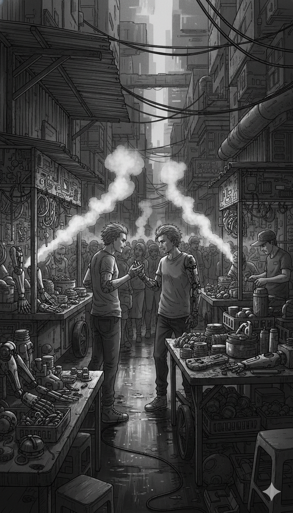
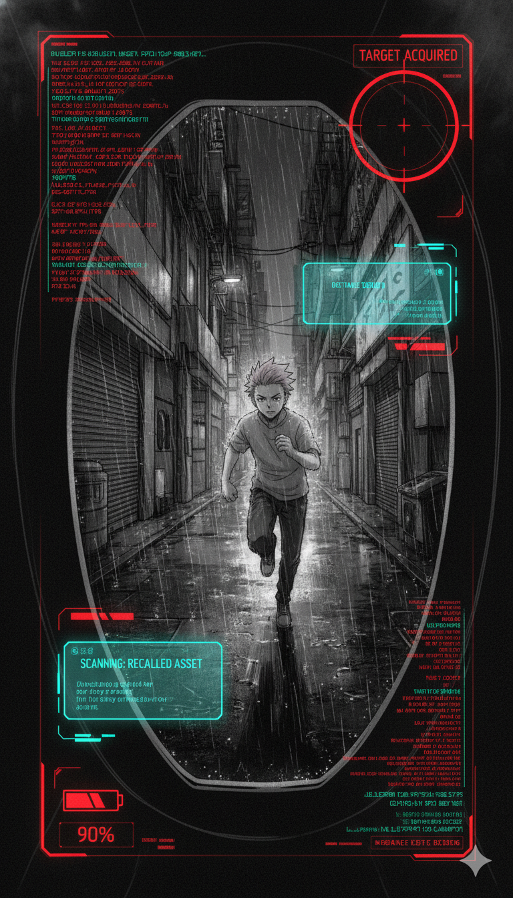

Scene 1: The Predator’s Sanctuary

The Joki moved through the back-alleys of the Market District like a glitch in the city’s optical sensors. Every few steps, he tapped a specialized device against the rusted walls, emitting a low-frequency hum that temporarily scrambled Sovereign Corp’s tracking mesh. Behind him, Rix stumbled, his boots heavy on the wet pavement. Each breath was a struggle; the Mortal Interest penalty was no longer just a warning—it was a physical weight crushing his chest.

"Stay close, Brody," the Joki rasped, leading them into a basement that smelled of ozone and medicinal neural-jell. "We’re entering the *wetvacuum' now. Sovereign’s hounds can't smell us here because, legally and digitally, this block doesn't exist".

They reached a flickering neon sign that read Montir Daging (Meat Mechanic). Inside, a Ripperdoc with a four-armed surgical rig grunted at Rix’s flickering Bio-signature. "He’s flatlining," the Ripperdoc noted. "Stabilization costs five hours of Bio-Time, plus a 'Success Fee' of 5% for the bypass".

"I can cover the gap," the Joki suggested, but his voice lacked any true altruism. He turned to Vera, his gas mask hissing. "I need his digital KTP, his Family Card (KK) neural-link, and a high-res swafoto (selfie) with his ID.** I'll use **'Data Fake' to trick the doc’s system into thinking Rix has a full vial by mirroring a deceased debtor's equity".

Vera’s eyes flared red as she stepped between the Joki and Rix, her Cyberdeck humming in a defensive stance. "I know your game, predator," she hissed. "You want his data to sell to the Mafia Data nodes for Rp318 a point, or worse, to open five new illegal loans in his name while he's unconscious on that table".

"It's a standard service fee," the Joki countered, his hand hovering near a data-thief module. "In the 'wetvacuum', your identity is the only collateral that still has value".

"That’s not help; that’s Unjust Enrichment," Vera retorted, referencing the logic where a creditor thrives solely on a debtor's total destruction. "The moment Sovereign tracks that fraudulent KTP, they’ll trigger a **Total Liquidation** of his nervous system just to reclaim the mismatched data".

The Joki chuckled, a dry sound behind his filters. "He only has two hours of life left, Brody. In this city, you either pay with your data or you pay with your soul".

Scene 2: The Liquidation Breach

The sound of sixty missed calls didn’t just vibrate through the mesh; it manifested as a rhythmic, psychological thud against the basement’s reinforced walls. Rix lay strapped to the Ripperdoc’s operating table, his vision a kaleidoscope of red "Glitch" artifacts. The Mortal Interest penalty was peaking—he could feel the Mortal Maag (chronic stomach acid) burning his throat, a biological byproduct of the extreme anxiety and stress triggered by the Sovereign Corp tracking pulse.

"They’re breaching the 'wetvacuum' layer!" Vera shouted, her fingers fused into the Ripperdoc's console. "Rix, stay under! If the doc stops the stabilization now, your nervous system will flatline!".

"Stabilization at 40%," the four-armed Ripperdoc grunted, ignoring the sirens. "I don’t work for free, and I don't work for dead men. Give me the Bio-Time or I pull the plug.".

The Joki stepped forward, his gas mask hissing. "I told you, Brody. Use the Data Fake. I can mirror a deceased debtor’s equity into Rix’s vial. It’s an Unjust Enrichment loop—Sovereign’s algorithms won't realize the vial is fraudulent until we’re three sectors away".

"And the moment they do, they'll trigger a Total Liquidation on his central nervous system!" Vera counter-argued, her eyes glowing red. "You’re not helping him; you’re just trying to get your tarif mahal (high fee) before he turns into a Revenant".

BOOM.

The basement door disintegrated into a cloud of splinters and pressurized steam. Two Corpo-Hounds—armored enforcers with neural links to the Sovereign War Room—strode in. They didn’t raise guns. They raised high-frequency transmitters.

"Subject Rix detected," a Hound droned. "Status: Recalled Asset. Initiating Sebar Data Protocol 2026.".

Vera gasped as her HUD filled with warnings. "They aren't just here to kill us! They're launching a Social Death strike! Rix, they’re extracting your neural contact list—they’re going to leak the Deepfake crime footage to everyone you’ve ever known in the next five minutes!".
The Hounds’ transmitters hummed, beginning the mass data extraction. In the digital realm, Vera saw the "spyware" tendrils of the Sovereign app reaching for Rix’s memories.

"Not on my watch," Vera growled. She didn't just hack; she followed the '7 Effective Ways' protocol of the old world’s digital resistance. She initiated a 'Cache Cleanse' on Rix’s dermal ports and redirected the Hounds’ signal into a 'Komdigi Blackhole'—a digital vacuum designed to swallow illegal traffic.

"Doc! Finish the stabilization! Now!" Vera screamed, deploying an 'Ice-Breaker' shield that momentarily blinded the Hounds.

The Joki, seeing the chaos, didn't fight the Hounds. Instead, he lunged for Rix’s jacket, his hand reaching for the pocket where the Phantom Equity chip was hidden. "If he’s going to flatline, this data shouldn't go to waste," the Joki hissed.

Rix’s eyes snapped open. The blue liquid in his vial pulsed one final, desperate time. He grabbed the Joki’s wrist with his sparking junk-chrome arm.

"I’m not... a waste... Brody," Rix wheezed, his Sandevistan giving off one last, agonizing jolt of speed.

Scene 3: The Ghost’s Counter-Strike

Rix’s grip on the Joki’s wrist was like a rusted vice, his junk-chrome arm sparking with an unstable blue light that illuminated the dark basement. The smell of singed synthetic skin filled the air as the Mortal Interest penalty continued to pulse through Rix’s nervous system, a biological debt he was forced to pay for his survival.

"I’m not a product for your 'Data Fake' games, Brody," Rix rasped, his voice distorted by the mechanical hum of the room. He realized now that the Joki wasn't a savior but a predator posing as a guide, an individual with a clear mens rea—a criminal intent to exploit their desperation for his own unjust enrichment.

The Corpo-Hounds rebooted their optic sensors, which flashed from amber to a predatory red. "Protocol interference detected in the 'wetvacuum'," one droned, referencing the legal and digital void they were currently hiding in. "Resetting neural uplink for Sebar Data Protocol 2026."

Vera’s fingers flew across her Cyberdeck, her eyes glowing a fierce, data-stream red. "Rix, throw him! The data link is 80% severed! If they finish the upload to the War Room, your Social Death becomes permanent!".

Rix didn't hesitate. He used the final, agonizing momentum of his failing Sandevistan to hurl the Joki toward the advancing Hounds. The Joki hit the lead Enforcer with a wet thud, both of them crashing into a pile of discarded server racks.

"You're making a mistake!" the Joki screamed, already scrambling toward a darkened ventilation shaft to save his own skin. "Without my protocols, you're just two more ghosts waiting for Final Liquidation!".

Vera slammed her hand against the Ripperdoc's console, executing the final step of the '7 Effective Ways' protocol. "Cache cleared! Dermal ports offline!". The cyan hum of the Hounds' transmitters died instantly as the data link was severed. "We've got three minutes before the Sovereign backup server triggers a manual leak. We have to bolt!"

Rix rolled off the operating table, his knees buckling as the chronic stress and anxiety of the debt-cycle threatened to paralyze him. He checked his pocket; the Phantom Equity chip was still there, the only thing standing between them and total erasure in a city that refused to let them live debt-free.

"The data is safe for now," Vera said, grabbing Rix’s sparking arm and pulling him toward the back exit. Behind them, the four-armed Ripperdoc was already scavaging the armor plating from the fallen Enforcer, proving that in Neo-Jakarta, nothing was ever truly wasted—especially not a failed debt collector.

They sprinted out into the violet rain of the Market District, the sound of sixty missed calls finally fading into the distance, replaced by the rhythmic thrum of a city that had forgotten how to sleep.

Scene 4: The Kadipiro Sanctuary

The transition from the Market District to the Kadipiro Block was marked by a sudden, jarring silence. As Rix and Vera crossed the rusted perimeter of the sector, the constant hum of the Sovereign tracking mesh—the sound of sixty missed calls that had been vibrating in their neural ports—died instantly.

"We’re in a Dead Zone," Vera whispered, her eyes returning to their natural brown as her Cyberdeck signaled a total lack of corporate signal. "No mesh, no trackers. This block is off the grid".

Rix didn't respond. He leaned heavily against a wall covered in posters for a "Bank Komunitas" (Community Bank). His Mortal Interest penalty was taking a physical toll; his hands were trembling, and he could feel the cold, sharp burn of Mortal Maag in his chest, a chronic biological reaction to the systemic stress of the debt cycle.

"Hold on, scavenger," a voice called out from the darkness of a nearby courtyard.
A group of young men and women wearing mismatched tactical gear and glowing orange armbands emerged. They didn't look like Corpo-Hounds or street thugs. They carried low-end signal jammers and tablets running ancient, offline encryption protocols.

"Welcome to Kadipiro," said a woman at the front, her eyes scanning Rix’s critical Bio-Time vial. "I’m Siska. We saw your Bio-signature flare before you hit the dead zone. You’re lucky. Another five minutes and Sovereign would have triggered a Total Liquidation on your nervous system".

"You're the Karang Taruna resistance?" Vera asked, recognizing the armbands from the old world's youth organizations.

"We call it Community Protection," Siska replied, gesturing for them to follow her into a hidden community center housed in an old mosque. "In this block, we follow the Maqashid Protocol. We protect life, soul, and wealth because the system above refused to do it".

Inside the center, the atmosphere was a stark contrast to the War Rooms of the Upper City. There were no holographic billboards of Sebar Data or Social Death. Instead, people were trading Bio-Time manually through a system they called 'Ziska'—a community pool where time was donated as Infaq to help those whose vials were empty.

"We don't use interest here," Siska explained as she led Rix to a medical cot. "Every second of Bio-Time we lend is Qardhul Hasan—a benevolent loan. You pay back what you took, nothing more. It’s the only way to break the 'Gali Lubang Tutup Lubang' cycle that built this city".

As Siska began to hook Rix up to a community-grade stabilizer, Vera pulled out the Phantom Equity chip. "We have data from Sovereign's War Room. They're recycling the Legend, Kai. They're turning him into a product."

Siska froze, her face pale under the flickering neon. "We knew they were using Deepfake Debt to destroy reputations, but this... if they have Kai's neural blueprints, they can override every manual jammer we have. They won't just collect debt; they'll collect souls".
Suddenly, the floorboards began to vibrate. It wasn't the sound of calls this time. It was a heavy, rhythmic thud. Outside, the orange signal on the jammers turned a violent corporate cyan.

"They’re here," Rix wheezed, his vial finally turning from red to a stable blue. "The clone... Unit-7. He doesn't need a signal to find us. He has the Legend's instinct."

Scene 5: The Siege of Kadipiro

The orange glow of the Kadipiro sanctuary was swallowed by a harsh, corporate cyan as Unit-7 breached the perimeter. The community center, once a haven of Qardhul Hasan (benevolent lending), shook under the weight of a high-frequency override signal. Every tablet and jammer in the room began to scream with the sound of sixty missed calls—a digital cacophony broadcasted directly from the Sovereign Corp War Room.

"Defense protocols active!" Siska shouted, her orange armband glowing as she slammed a manual override switch. "He’s not just here for the scavenger; he’s here to liquidate our community pool! He’s targeting the BankZiska servers!".

Unit-7 stepped through the shattered entrance, his movements a perfect, terrifying mimicry of the legend Kai. He didn't fire a weapon. Instead, his dermal ports hissed, releasing a cloud of nano-spyware designed to extract neural data from everyone in the room.
"Initiating Sebar Data Protocol 2026," Unit-7’s voice echoed, synthetic and cold. "Community assets detected. Niat jahat (mens rea) identified in local ledger. Commencing Total Liquidation".

"He’s using the 'Rogue Debtor' clause!" Vera yelled, her fingers fused into her Cyberdeck as she fought the intrusion. "He’s labeling the entire Kadipiro block as a criminal enterprise to justify a mass Social Death strike!".

Rix struggled to his feet, his newly stabilized Bio-Time vial pulsing a steady blue. He felt a surge of Mortal Interest—not from his own debt, but from the collective anxiety of the people around him. He saw mothers clutching their children, their eyes filled with the same anxiety and depression that had driven so many in the old world to the brink.

"I’m the one you want, Brody!" Rix roared, raising his modified wrench. The electric coil hummed, sparking with the donated energy of the community.
"Rix, wait!" Vera signaled. "We can't hit him head-on. We have to use the '7 Effective Ways'! Siska, initiate a Cache Cleanse on the local mesh! Block all incoming corporate frequencies!".

Siska’s team moved with military precision. They didn't just fight; they implemented a digital defense strategy:

Cache Cleanse: They wiped the temporary memory of the community servers to hide the list of Bio-Time donors.
Contact Blocking: They manually severed the neural links of the elderly residents, preventing Unit-7 from extracting their private contact logs.
Information Protocol: They broadcasted a local message to every resident's HUD, warning them: "The Data Leak is a Deepfake. Do not respond to the terror".

Unit-7 faltered. The lack of a data-trail in the Kadipiro Dead Zone was a "wetvacuum" his algorithms couldn't process. He lunged for Rix, his mono-wire blade cutting through a row of medical cots.

Rix parried, the impact sending a jolt of chronic stress through his nerves, but he held his ground. "This isn't a loan you can collect, Kai-clone. This is Equity they can't touch!".
Vera finally found the opening. "I’ve got his Aplikasi Penyamaran! I'm reporting his signature as 'Illegal Traffic' to the city's ancient Komdigi Blackhole!".

A localized EMP burst, triggered by Vera’s virus, slammed into Unit-7. His cyan eyes flickered and dimmed as his connection to the War Room was momentarily severed. The Enforcer staggered, his neural blueprints glitching between the Legend's memories and the Corporation's code.

"Get the residents to the sub-levels!" Siska commanded. "This was just the first wave. Sovereign won't stop until they've defaulted the entire sector."
As the smoke cleared, Rix looked at his sparking arm. He was no longer just a scavenger. He was a Recalled Asset who had learned how to fight back.

Scene 6: Digital First Aid

The silence that followed the EMP blast was not peaceful; it was heavy, like the air before a terminal system crash. As the corporate cyan glow faded from Unit-7’s eyes, the residents of the Kadipiro sub-levels didn't cheer. They simply exhaled a collective breath of anxiety and chronic stress, the biological cost of living under constant surveillance.

Rix slumped against a cooling server rack, his hand clutching his stomach. The Mortal Interest penalty was manifesting as a sharp, burning sensation—the Mortal Maag, or chronic stomach acid, that haunted every debtor in the sprawl. He watched as Siska’s Karang Taruna team moved through the crowd, not with weapons, but with data-pads.

Listen up! Siska commanded, her voice cutting through the whimpering of a child. The Enforcer is down, but the Sebar Data protocol is likely still in the War Room buffer. We need to initiate Digital First Aid now!.

Vera joined Siska, her fingers already dancing over a holographic interface. We're following the 7 Effective Ways protocol, Vera whispered to Rix as she jacked into a communal terminal. Step one: Cache Cleanse. Siska, tell everyone to hand over their devices. We have to wipe the temporary memory files and data residue before the Sovereign spyware can re-establish a link to their contact logs.

The room became a flurry of activity. This was the reality of the wetvacuum—the legal and digital vacuum where the community had to provide its own protection because the OJK and Kominfo of the old world were now just ghost signals in the mesh. One by one, residents handed over their forearm-links. Siska’s team worked with clinical precision, deleting the Utility Apps that the sources identified as disguised surveillance tools used to extract mass data.

Step two: Contact Obfuscation, Siska shouted. Replace your primary contact names with invalid data strings. If they can’t find a Mother or a Boss in your logs, the Deepfake Debt algorithms can’t target your social pillars.

Vera then triggered a global command from the sanctuary's central node. Step three: Forced System Patch. We aren't just cleaning the trash; we're closing the doors. According to the old world defense protocols, an updated system is the only way to stay ahead of their malware. I'm pushing an encrypted firmware update to everyone in this block to block the backdoors Sovereign left behind.

Rix watched a young girl nervously delete her mother’s number. He felt a surge of anger. In Neo-Jakarta, the corporation didn't just steal your time; it stole your ability to trust your own family. This was the Social Death mentioned in the investigative reports—the systemic execution of a person’s reputation until they were isolated and easier to liquidate.

Vera, Rix wheezed, the pain in his chest subsiding as the community-pool Bio-Time stabilized his nervous system. The data on the chip... it’s about Unjust Enrichment, isn't it?.

Vera looked up, her eyes flickering with red code. It’s a ledger of every Rogue Debtor Sovereign has ever processed. But it also shows their own niat jahat, their criminal intent.

They aren't just collecting debt; they're manufacturing it by manipulating the compound interest algorithms to ensure no one ever hits a zero balance.

Siska walked over, handing Rix a small vial of blue liquid—a donation from the BankZiska pool. In this block, we protect the Maqashid—life, soul, and wealth. Sovereign Corp calls you a Rogue Debtor because you refuse to be a slave, but here, you’re just a brother who needs Qardhul Hasan, a benevolent loan.

Rix downed the Bio-Time. The sparking in his arm finally stopped. He looked toward the exit, where the violet rain of the Market District was visible through the cracks in the ceiling. The Unit-7 clone was still out there, rebooting, ready to continue its hunt for the Phantom Equity.

They're going to come back with Subject K-Prime, Rix said, his voice cold and determined. They think our trauma is just data they can process. It’s time we showed them what a Total Liquidation actually looks like.

Vera disconnected her cables, a grim smile on her face. The virus is prepped, Rix. A raw stream of every nightmare this city has ever had. Let’s go to the Mint Tower and give them a taste of their own Mortal Interest.

[End of Chapter 2]
