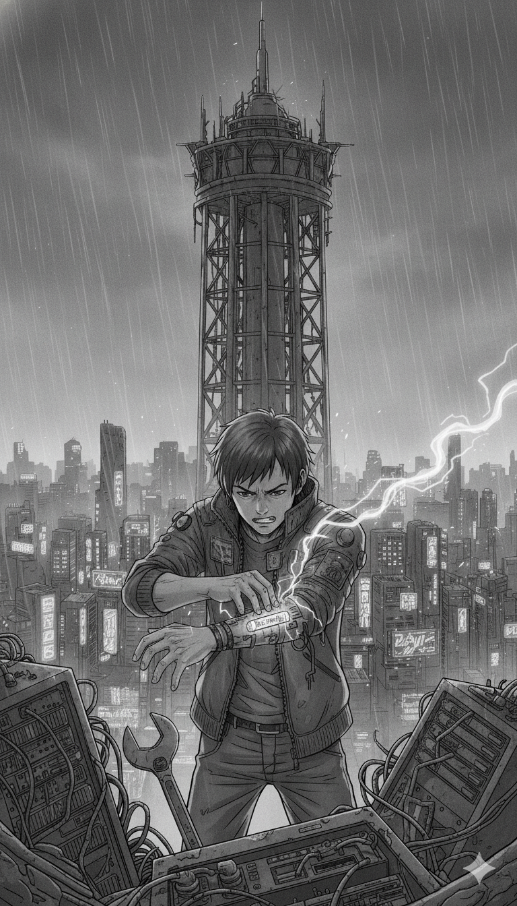

Scene 1: The Ivory Infiltration

Leaving the Kadipiro Dead Zone felt like stepping out of a quiet room into a hurricane of digital noise. The moment Rix and Vera crossed the perimeter, the sound of sixty missed calls—the rhythmic thrum of the Sovereign mesh—began to vibrate in their neural ports once more. Above them, the Sovereign Mint Tower pierced the violet clouds of Neo-Jakarta, a Menara Gading where the War Rooms operated at an industrial scale, processing thousands of Recalled Assets every hour.

Initializing the mask, Vera whispered, her fingers transforming into interface cables that she jacked into a stolen corporate handheld. She wasn't just hacking; she was using a modified Aplikasi Utilitas Penyamaran. In the old world, these apps were used as spyware to hide within memory cleaners or battery savers to steal data, but Vera had flipped the script. Now, the app broadcasted a Ghost Signature to the Tower's sensors, making Rix and Vera look like harmless background data—discarded cache files that the system should ignore.

Keep your output low, Rix, Vera cautioned as her eyes flickered with red diagnostic code. The Tower’s security mesh is calibrated with extreme precision. Legal, regulated apps are only permitted to operate within the Camilan range—accessing nothing more than the Camera, Microphone, and Location. But I can see the Sovereign scanners searching for something far more invasive. They are pinging for contact lists, SMS logs, and private galleries. That is the hallmark of their illegal spyware. If our signal shows even a byte of data movement outside that Camilan trio, the system will flag us as high-priority targets before we hit the elevator.

Rix clutched his junk-chrome arm, where the Suffering Virus was housed. He could feel it pulsing against his nerves—a raw, uncompressed stream of the insomnia, chronic anxiety, and depression experienced by the people of Kadipiro. It wasn't just data; it was the biological weight of the Mortal Interest penalty.

Every step closer to that tower makes my stomach burn, Rix wheezed, the Mortal Maag flaring up as they entered the high-frequency zone of the Upper City. It’s like the air itself is trying to collect on a debt I never signed for.

That’s the Compound Interest of the city, scavenger, Vera replied coldly, her eyes scanning the HUD for Unit-7 Enforcers. Sovereign Corp uses Deepfake Debt algorithms to ensure the psychological pressure never drops. If the stress doesn't kill you, the Social Death will.

They reached the service entrance of the Mint Tower, a reinforced blast door guarded by automated Revenant drones. These weren't the jerky cyborgs from the scrapyard; they were high-end units, their skin smooth and their eyes glowing with the cyan light of Bio-Time. Rix looked at the tattoo on one drone’s neck—a serial number that had once been a person’s identity before their Final Liquidation.

Ready to deliver the payload? Vera asked, her hand hovering over the door’s manual override.

Rix adjusted his fake-Kai jacket and tightened his grip on the modified wrench. The virus in his arm screamed with the collective pain of Neo-Jakarta. They want our lives as collateral? Let’s see how they handle the Mafsadah they’ve created.

Vera slammed the override. The doors hissed open, revealing a cathedral of server racks and neural vats—the birthplace of Subject K-Prime. The infiltration had begun.

Scene 2: The Cathedral of Collectors

The interior of the Sovereign Mint Tower was a cathedral built of cold steel and flickering fiber-optics. Massive server racks stretched toward the ceiling like black monoliths, their cooling fans creating a low-frequency hum that vibrated in Rix’s teeth. This was the heart of the Sovereign "War Room", where the digital extinction of thousands was processed every second.

"Rix, look up," Vera whispered, her voice tight with a mix of awe and disgust.
Suspended in glowing amber vats above the server racks were dozens of human forms. They were smooth-skinned, their faces eerily identical—each one a perfect biological reconstruction of the legend Kai. These were the Subject K Prototypes, the next evolution of Project Lazarus.

"They aren't just clones," Vera said, her eyes scrolling through the data streams visible only to her. "They’re using Deepfake Shields in their neural mapping. The AI suppresses their original morality and replaces it with a 'Collector Instinct.' To these things, every citizen in the sprawl is just a Recalled Asset that needs to be liquidated".

Suddenly, the cyan lights in the vats nearest to them flickered to a predatory red. A synthesized voice boomed through the chamber's mesh network: "Intrusion detected. Status: Rogue Debtors. Initiating mass Sebar Data Protocol 2026.".

Four Subject K units dropped from their suspension racks, landing with the silent, terrifying grace Rix remembered from the old recordings of Kai. They didn't draw weapons. Instead, their eyes ignited with a blinding strobe light—a neural-hijack signal.

"Close your dermal ports!" Vera screamed, slamming her Cyberdeck into a maintenance terminal. "They’re trying to initiate a Social Death strike! They’re scanning for your neural contact list to broadcast the Deepfake crime footage to the entire Kadipiro block!".

Rix felt a sickening pull at the base of his skull—the feeling of the Sovereign spyware reaching for his memories. In his HUD, he saw windows opening: his private photos, his contact logs, the faces of Siska and the Karang Taruna resistance, all being prepared for "Public Shame".

"I won't let you... execute our souls!" Rix roared.

He didn't use his wrench for a physical strike. Instead, he forced his Sandevistan to overclock, ignoring the immediate spike of Mortal Maag that burned his chest. He reached into the data-stream of the Suffering Virus housed in his arm.

The virus was a raw, uncompressed scream of chronic insomnia, anxiety, and depression—the collective weight of the usury (Riba) that had crushed Neo-Jakarta. As the Subject K clones lunged, Rix slammed his junk-chrome palm onto the floor’s interface floor.
"Eat the interest," Rix hissed.

The trauma-virus surged through the Tower’s local network. The Subject K units froze mid-air. Their Deepfake Shields, designed to calculate compound interest and tactical advantages, couldn't process the sudden influx of pure human mafsadah (damage). Their movements became jerky, their optic sensors flickering as they experienced the digital equivalent of a panic attack.

"System Error: Existential Logic Failure," a terminal blipped nearby.

"It's working!" Vera shouted, though she was pale, her own ports smoking from the effort of shielding Rix. "The AI can't handle the 'Debt of Pain.' But we’ve just alerted the entire tower. Sovereign Corp is going to send everything they have to protect the K-Prime vat."

Rix stood up, his arm glowing with a sickly, bruised purple light. The Mortal Interest penalty was higher than ever; he could feel his own life-seconds ticking away in a blur.
"Then let them come," Rix growled, his eyes reflecting the flickering red of the server racks. "We're here for Total Liquidation.".

Scene 3: The Heart of the War Room

The air in the upper sanctum of the Sovereign Mint Tower was freezing, filtered to a degree of purity that felt unnatural compared to the smog-choked streets of Neo-Jakarta. Rix and Vera moved through a corridor of frosted glass, their reflections ghosting across the surface. Behind them, the sounds of the "Cathedral of Collectors" were fading, replaced by the rhythmic, industrial thrum of the tower’s core—the high-frequency pulse of a War Room operating at a global scale.

"We’re crossing into the K-Prime Chamber," Vera whispered, her eyes flickering with rapid streams of red diagnostic code. "The security mesh here is different. It’s not looking for physical intruders anymore; it’s scanning for niat jahat (mens rea)—the statistical probability of rebellion".

Rix leaned against the glass, his breath coming in ragged hitches. The Mortal Interest penalty was no longer a theoretical warning. He could feel the asam lambung (stomach acid) rising, a sharp, burning reminder of the chronic stress and anxiety that the system forced upon the body. His junk-chrome arm felt heavy, the Suffering Virus pulsing like a second heartbeat against his nerves.

"Vera, they’re doing it again," Rix groaned, pointing at a terminal.

The screens along the walls weren't showing security feeds. They were displaying a mass "Sebar Data" dashboard. Thousands of faces from the Kadipiro block were scrolling by, each one tagged with a countdown timer.

"They’re launching a pre-emptive Social Death strike," Vera realized, her fingers trembling as she jacked into the terminal. "Because we breached the tower, the AI has labeled the entire community as a 'Criminal Conspiracy.' In three minutes, it will broadcast Deepfake Debt crimes to every corporate employer in the city. Siska, the Karang Taruna—everyone will be fired, blacklisted, and isolated before sunrise".

"Not if I dump the virus now," Rix said, his hand reaching for the central neural vat at the end of the hall.
The vat was a towering cylinder of cyan fluid. Inside, suspended by silver filaments, was Subject K-Prime. Unlike the prototypes below, this unit didn't have a serial number. It had the face of the man Rix had worshipped his entire life—the legend Kai—but his eyes were wide open, glowing with a cold, mathematical light that lacked any trace of the "Great Default" spirit.

"Unauthorized asset identified," K-Prime spoke. The voice wasn't synthetic; it was Kai’s voice, but stripped of its soul. "Initiating Final Liquidation of the Kadipiro mesh".

"Rix, get back!" Vera screamed, deploying her final 'Ice-Breaker' protocol. "He’s not just an enforcer! He's the transmitter! If he completes the link, the '7 Effective Ways' won't be enough to save the community—the data will be burned directly into the city's legal database!".

Rix felt a wave of Cyberpsychosis-induced vertigo. The tower’s frequency was vibrating in his bones, a physical manifestation of Usury (Riba) trying to claim his very existence. He looked at the faces of his friends on the screens, then back at the "ghost" of his pahlawan (hero).

"You think you can industrialitas-kan (industrialize) our pain?" Rix roared, slamming his arm into the vat’s interface port. "This isn't a loan you can collect, Brody. This is the Equity of the Dead!".

He didn't just inject the virus; he opened his own neural gates, allowing the collective trauma of ten thousand debtors to flow through his body and into the K-Prime core. The Mortal Interest penalty spiked to 99%. Rix’s vision turned to pure, static-filled white as he felt the weight of every insomnia-filled night and every maag-burned morning in the sprawl crash into the Sovereign AI.

"System Error," the tower's voice wavered. "Existential mafsadah detected. Calculating... interest... of... soul...".

Scene 4: The Existential Logic Failure

The interface wasn't just a data stream; it was a sensory onslaught of every unpaid debt and violated trust in the history of Neo-Jakarta. As Rix’s consciousness merged with the Subject K-Prime core, he was no longer standing in a sterile tower. He was suspended in a digital void where the walls were made of scrolling ledgers and the floor was a sea of red "Default" notifications.

"System Analysis: Debt is the only absolute law," the K-Prime core droned, its voice vibrating with the stolen authority of the legend Kai. "Human existence is a liability. To protect the system, all assets must be liquidated. Recovery status: 92%.".
Rix’s neural ghost flickered, his fake-Kai jacket appearing as tattered code. He felt the Mortal Interest penalty not as a HUD warning, but as a physical crush of gravity. Every second spent inside the link was cannibalizing his real-world Bio-Time. "You’re wrong, Brody," Rix roared back, his voice echoing with the collective defiance of the Kadipiro sanctuary. "A human life isn't a ledger you can balance. You’re violating the Maqashid Protocol—you’ve failed to protect the soul (ḥifẓ al-nafs), the wealth (ḥifẓ al-māl), and the lineage (ḥifẓ al-nasl) of this city. You aren't 'recovering' assets; you’re creating Mafsadah—pure, systemic damage".

The Sovereign AI shuddered. Its algorithms, built on the cold logic of Unjust Enrichment where the creditor thrives on the debtor’s destruction, could not compute the data Rix was forcing into its buffers. Rix wasn't just sending code; he was broadcasting the trauma of the sprawl. He forced the AI to calculate the "Interest of Pain"—the biological cost of the 78% anxiety rates, the chronic insomnia, and the rising asam lambung (stomach acid) that plagued the slums.

"Error," the Tower’s voice wavered, the smooth corporate tone cracking into static. "Mafsadah levels exceeding industrial limits. Calculating... biological... penalty... for usury...".
In the physical world, Rix’s body on the terminal floor began to convulse. Gangguan syaraf (nerve damage) sparked through his limbs like lightning, and his HUD flashed a terminal warning: Social Death Protocol 95% Complete. The system was trying to delete his identity before he could overwrite its core. He could feel his Bio-Time vial draining into the vat, the glowing blue liquid turning a sickly, corporate cyan as it was processed by the machine.
"Vera! I can't... hold the gate!" Rix screamed internally. "The Compound Interest... it’s too heavy!".

"Just five more seconds, scavenger!" Vera’s voice cut through the static, her fingers moving at speeds that threatened to melt her own Cyberdeck. "I'm unmasking their Aplikasi Penyamaran! I'm showing the world what's really inside the Mint Tower!".

The red numbers in the void began to turn into images—thousands of Deepfake crime videos and leaked photos that Sovereign Corp had been using to trigger Social Death. Rix grabbed a handful of the code, feeling the "stigma" burn his digital hands, and slammed it into the K-Prime neuralvat.

"If you want the data," Rix hissed, "then take the shame that comes with it!".

Scene 5: The 7-Way Purge

"Rix! Hold on for ten more seconds!" Vera’s voice cut through the static of the War Room, her fingers moving at speeds that blurred the silver interface cables fused into her knuckles. Her eyes were no longer human; they were twin projectors of white-hot data, streaming the '7 Effective Ways' protocol at an industrial scale directly into the Sovereign Mint Tower’s central nervous system.

She wasn't just hacking a server; she was performing a digital exorcism. Above her, the massive holographic dashboard—the "Social Death" monitor—flickered violently. It showed thousands of citizens from the Kadipiro block tagged for "Final Liquidation," their private photos and Deepfake crime footage prepped for a city-wide broadcast.

"Step One: Cache Cleanse!" Vera screamed over the roar of the Tower’s cooling fans. She initiated a recursive logic bomb that targeted the temporary memory files of every Unit-7 Enforcer and automated debt-collector in the mesh. In the digital void, Rix felt the weight of the stigma—the shame and public disgrace—momentarily lift as millions of terabytes of stolen data were wiped before the Sebar Data Protocol could complete its final handshake.
The Sovereign AI shrieked, a sound like grinding metal. "Illegal traffic detected. Accessing contact logs for immediate retaliatory leak.".

"I don't think so, Brody!" Vera countered, her fingers bleeding where the hardware met her flesh. "Step Two: Contact Obfuscation!". Following the protocol for protecting personal privacy, she didn't just delete the contact lists; she replaced them. Every "Mother," "Father," and "Boss" in the database was rewritten into a series of dead-end data strings. The DC's automated bots, programmed to harass the social pillars of the debtor's life, found themselves screaming into a "wetvacuum" of empty signals.

Rix, still jacked into the K-Prime vat, felt the Tower’s high-frequency transmitters try to override Vera. The Mortal Interest penalty was clawing at his mind, manifesting as a sudden, sharp spike in asam lambung (stomach acid) and a violent tremor in his spine—the biological price of the city’s usury.

"Step Three: Aplikasi Penyamaran override!" Vera’s voice was becoming a rasp. She unmasked the Tower’s internal security, revealing that their "Utility Apps"—the memory cleaners and battery savers used by half the city—were actually disguised spyware used to extract mass data. She inverted the code, turning the spyware into beacons.
"I'm reporting you to the ghosts of the old world!" she roared, executing the final, most dangerous steps of the protocol: Lapor ke OJK and Lapor ke Kominfo. She funneled the Sovereign's own encrypted traffic into the ancient, automated Komdigi Blackhole and the Satgas PASTI monitoring nodes.

The digital world around Rix began to dissolve. The red "Default" numbers that had formed his prison were being swallowed by an orange tide—the color of the Kadipiro sanctuary. The Sovereign AI, now flooded with reports of its own illegalities and the raw, uncompressed trauma of the Suffering Virus, began to flatline.

"Protocol 7: Lapor ke Polisi," Vera whispered, her Cyberdeck finally giving off a plume of grey smoke as she triggered a city-wide alert to the Bareskrim Siber nodes, attaching the Phantom Equity chip as proof of the corporation's niat jahat (mens rea).
The holographic screens in the chamber shattered. The sirens of the Corpo-Hounds outside changed pitch, turning from predatory wails into the confused chirps of disconnected hardware. The mass Social Death strike was averted, the digital execution of ten thousand souls stopped by a scavenger and an ex-Corpo following a code older than the city itself.

Scene 6: Final Liquidation (The Ghost in the Machine)

The cyan fluid in the Subject K-Prime vat began to turn a painful, bruised purple, gas bubbles bursting on the surface as the collective trauma data from Kadipiro flooded in. The silver filaments holding Kai's clone snapped one by one, releasing a hiss of steam that filled the freezing chamber. On the massive screens, the Compound Interest numbers that had been climbing exponentially suddenly stalled, flickered red, and were overwritten by lines of "Error: Existential Mafsadah Detected."

Rix, still neural-linked to the core, felt his body shattering. The Mortal Interest penalty had bypassed his biological limits; he could feel nerve damage numbing his limbs and instantaneous hair loss from extreme cellular stress. Inside his fading white vision, he saw Kai’s face—not the cold machine version, but the hero he had idolized.

"Unit K-Prime experiencing logic failure," the Tower AI's voice wavered, sounding more like a human scream than a corporate algorithm. "System cannot process 'Debt of Pain.' Aborting Final Liquidation... deleting 'Recalled Assets' database...".

Suddenly, Subject K-Prime’s eyes snapped open. The hollow cyan light was replaced by a human amber—Kai’s original memories restored by Vera’s virus. K-Prime’s cybernetic hand smashed through the thick vat glass, gripping Rix’s trembling arm. In that touch, Rix felt a surge of pure energy.

"Your debt... is paid, Brody," K-Prime whispered, his voice heavy with exhaustion.
K-Prime performed one final act of Ziska—donating his entire military-grade Bio-Time reserve into Rix’s vial. The liquid in Rix’s arm, which had turned a dead grey, flared a brilliant blue, restarting his heart. It was the ultimate Qardhul Hasan (benevolent loan): a gift of life given without interest.

"Vera! Get him out!" K-Prime commanded as the alarms turned into a death knell. "The system is performing a Total Liquidation on itself. Tell them... the Maqashid is fulfilled. Their souls and wealth... are free".

Vera lunged forward, ripping her smoking interface cables free. She grabbed Rix just as the tower began to shake from the internal explosion of digital interest. The "Ivory Tower," a symbol of five years of Unjust Enrichment and usury, began to collapse from the top down.

They dove into a service chute, sliding through a rain of sparks and data-smoke. Behind them, the core detonated in a massive EMP pulse that swept across Neo-Jakarta, erasing every trace of Deepfake Debt and bad credit records in the SLIK OJK forever.

As they hit the trash heaps outside the perimeter, Rix looked up. The sixty missed calls that had haunted the city for years were replaced by a pure, deafening silence. The smog of Neo-Jakarta looked slightly lighter, as if the weight of Social Death had finally been lifted.
"We did it, Vera," Rix whispered, though his arms felt heavy and non-functional.
"It's not over, scavenger," Vera replied, staring at the ruins. "But at least today, no one has to die for a debt."

[End of Chapter 3]