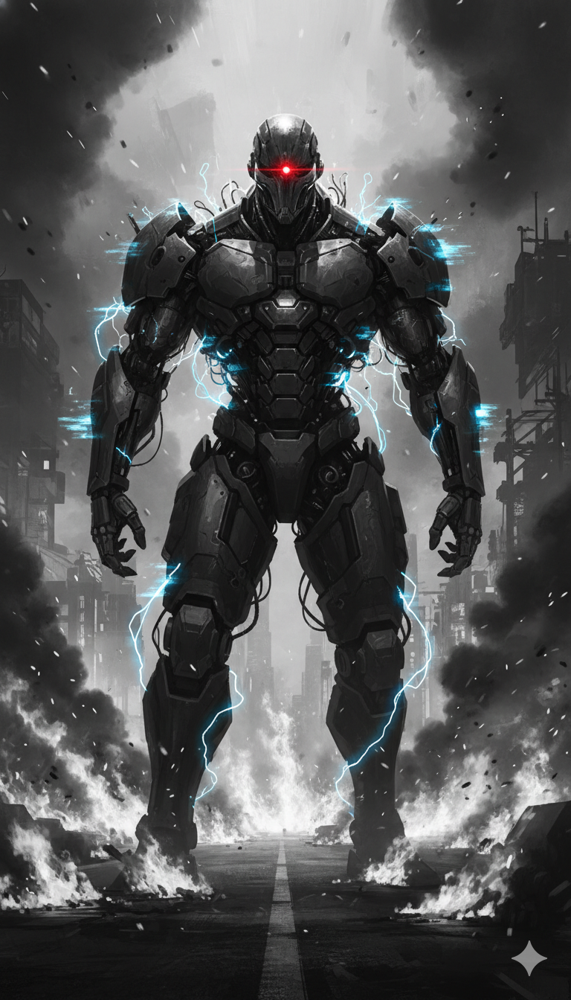

Scene 1: The Sovereign Breach

The Sovereign Mint Tower didn't just collapse; it bled light. As the central core approached critical mass, the massive data-conduits lining the walls pulsed with a violent, corporate cyan. Rix and Vera were no longer sneaking; they were a glitch in the city’s heart that the system was desperately trying to purge.

"Rix! To the left! Revenant squad incoming!" Vera’s voice crackled through the comms, distorted by the rising electromagnetic interference of the tower’s failing reactor.

Rix didn't look. He felt the vibration in his teeth—the high-frequency hum of a military-grade Sandevistan overclocking. He lunged, his modified wrench screaming with unstable electricity. He didn't just hit the first Revenant; he shattered its ceramic plating, sending a shower of sparks and black coolant across the white-tiled floor.

"Warning: Bio-Time depletion imminent," his HUD flashed in a sickening red. "Mortal Interest penalty: 92%.".

Rix ignored it. The chronic stress and anxiety that had plagued him since the Market District was gone, replaced by a cold, singular purpose. He was no longer just a scavenger; he was the delivery system for the Suffering Virus. In his junk-chrome arm, the collective pain of the Kadipiro block—the insomnia, the Mortal Maag, and the trauma of Social Death—was a physical heat that threatened to melt his neural ports.

"The 'War Room' is trying to initiate a manual backup!" Vera shouted, her fingers fused into a terminal as she rode the data-stream. "They’re trying to move the Deepfake Debt database to an off-site server in the Upper City. If that data leaves this tower, our victory is a lie!".

"Then we cut the throat of the beast," Rix growled. He vaulted over a server rack, his chrome arm twitching as he parried a mono-wire strike from a hidden Unit-7 enforcer.

The environment was a sensory nightmare. The tower’s automated defense system was broadcasting the sound of sixty missed calls at a deafening volume, a psychological weapon designed to trigger the Mortal Interest penalty in any debtor within range. Rix could feel his asam lambung (stomach acid) rising, but he forced himself forward.

"Vera, give me the '7-Ways' pulse!" Rix roared.

Vera didn't hesitate. She executed a Cache Cleanse on the tower’s local subnet, momentarily blinding the automated turrets. "Step One: Cache Wiped! Go, Rix! Reach the K-Prime elevator!".

Rix sprinted, his boots slick with synthetic oil. He was the manifestation of the city's Total Liquidation. Sovereign Corp had spent five years turning human lives into assets, and today, the assets were going to default.

Scene 2: The Cathedral of the Recalled
The elevator screeched to a halt at the apex of the Sovereign Mint Tower. As the doors hissed open, Rix and Vera stepped into a circular chamber that felt less like an office and more like a digital mausoleum. Massive glass pillars filled with glowing violet fluid lined the walls, each one housing a neural-link of a "High-Value Debtor" whose consciousness had been harvested for the Project Lazarus collective.

In the center of the room, suspended by silver filaments that pulsed with a cold cyan light, was Subject K-Prime.

He wore a tactical variant of Kai's legendary jacket, but his eyes were hidden behind a sleek, corporate visor that displayed a constant stream of Compound Interest calculations.

"Unauthorized asset detected," K-Prime spoke. The voice was a perfect digital reconstruction of Kai’s, but it lacked the rasp of a man who had lived in the slums. "Subject Rix. Status: Rogue Debtor. Cumulative interest has reached terminal levels. Initiating Final Liquidation".

"You aren't him," Rix spat, his hand clenching the modified wrench as his Sandevistan hummed, preparing for the strain. "Kai died to break the chains. You’re just the chain with a dead man's face".

K-Prime moved. It wasn't a human motion; it was a frame-skipping displacement. Rix barely had time to raise his wrench before a mono-wire blade lashed out, slicing through the air where his head had been a millisecond before. The shockwave of the movement sent a jolt of chronic anxiety through Rix’s nerves, a physical manifestation of the Mortal Interest penalty.

"Rix, get back!" Vera shouted, her fingers diving into a central interface port. "He’s not just fighting you physically! He’s using a Deepfake Shield to broadcast your location to every Desk Collector in the city! He’s trying to trigger a Social Death protocol on the entire Kadipiro block while we're here!".

The holographic screens surrounding them flared to life. Rix saw real-time feeds of the Kadipiro sanctuary. He saw Siska and the Karang Taruna being tagged as "Criminal Conspirators" in the city's mesh. Deepfake videos began to play on the billboards outside the tower, showing the residents of Kadipiro committing violent acts they never did—a calculated act of Sebar Data designed to justify a corporate purge.

"I'm losing the link!" Vera gasped, her eyes flickering red. "The Sovereign AI is using Unjust Enrichment logic—it's cannibalizing the data of the dead to power K-Prime's speed! I need more time to execute the Lapor ke OJK and Kominfo protocols!".

Rix roared, his vision blurring as his neural implants began to overheat. He felt the sharp burn of asam lambung (stomach acid) hitting his throat—the "Mortal Maag" triggered by the high-frequency corporate signal. He didn't just need to win; he needed to protect the Maqashid—the soul and the wealth of his people.

"Eat the trauma, you corporate glitch!" Rix screamed, slamming his sparking junk-chrome arm into the floor.
He opened his neural gates, releasing a second wave of the Suffering Virus. The air in the room seemed to thicken with the collective insomnia and depression of ten thousand debtors. K-Prime faltered, his visor flickering as the AI struggled to calculate the "Interest of Pain".

"Logic Error," the K-Prime unit droned, its movements becoming jerky. "Mafsadah levels... exceeding... industrial... capacity...".

"Now, Vera!" Rix wheezed, his Bio-Time vial pulsing a terminal violet. "Cut the line!".

Scene 3: The System Purge

The air in the cathedral chamber hummed with the frequency of a terminal crash as the Sovereign AI struggled to process the Suffering Virus Rix had injected. Rix was locked in a neural stalemate with Subject K-Prime, his Bio-Time vial flashing a violent, dying violet as the Mortal Interest penalty reached 95%. Every nerve in his body felt like it was being scraped by a mono-wire blade; his asam lambung (stomach acid) surged, a physical byproduct of the chronic stress and anxiety that the investigative sources identified as the hallmark of the debt cycle.

"Vera! The 'Social Death' protocol is still active in the secondary buffers!" Rix screamed through their shared link, his voice distorted by digital static.

Vera didn't look up from her console. Her eyes were twin projectors of red corporate code. "I'm executing the final stages of the '7 Effective Ways' at an industrial scale!" she shouted. She wasn't just blocking the tower’s signal; she was turning the Sovereign "War Room" against itself by reporting its own illegalities to the digital ghosts of the old world.

"Step Five: Lapor ke OJK (Reporting to OJK)!" Vera roared, her fingers fused into the data-stream. She didn't just send a message; she redirected the entire Phantom Equity ledger—the proof of Sovereign Corp's Unjust Enrichment—directly into the waspadainvestasi@ojk.go.id monitoring nodes. In an instant, the tower’s legal status flipped from "Regulated" to "Ilegal Entity" in the city's central mesh.

The Sovereign AI shrieked, a sound like grinding industrial gears. "Illegal traffic detected. Status: Recalled Asset protocol compromised. Calculating... administrative... penalties..."..

"Step Six: Lapor ke Kominfo (Reporting to Kominfo)!" Vera continued, her Cyberdeck giving off a steady plume of grey smoke. She flagged the Deepfake Debt database as "Illegal Content," triggering the ancient aduankonten.id blockades. The holographic billboards outside, which had been showing the residents of Kadipiro committing faked crimes, suddenly shattered into static as the Sebar Data protocol was cut at its source.

Rix felt the pressure in his skull lessen as the Deepfake Shield around K-Prime began to dissolve. He looked at the clone, whose visor was now flickering with error messages. "You’re not a legend," Rix wheezed, his body wracked by nerve damage and insomnia-induced exhaustion. "You’re just a predatory algorithm that forgot how to be human!".
The AI made one final, desperate move. It tried to initiate a "Total Liquidation" of Rix’s central nervous system, attempting to reclaim the "Bio-Time" it had invested in his chrome.
"Not on my watch, Brody!" Vera screamed, executing the final step: Lapor ke Polisi (Reporting to Police). She attached the Phantom Equity chip—the record of Sovereign’s niat jahat (mens rea)—to a city-wide alert broadcasted to the Patrolisiber nodes.

A localized digital vacuum—the "wetvacuum"—collapsed inward as the Sovereign AI was flooded with reports of its own violations of the UU Perlindungan Data Pribadi (Personal Data Protection Law). The system began to flatline, its logic of Compound Interest unable to survive the influx of pure human trauma and legal reckoning.

"Rix, the core is melting down!" Vera shouted, grabbing his arm and pulling him away from the sparking K-Prime vat. "The Maqāṣid is fulfilled! The soul and the wealth of this city are no longer collateral!".

As the Sovereign Mint Tower began to shake, Rix saw the K-Prime unit stop its lunge. For a single second, the amber light of the original Kai flickered in the clone's eyes. It wasn't a collector anymore; it was a ghost finding its peace.
They dove into the service chute just as the upper floors detonated in a brilliant explosion of corporate cyan, the sixty missed calls that had haunted Neo-Jakarta finally falling silent forever

Scene 4: The Social Death Feedback Loop

The explosion of data within the K-Prime Chamber wasn't just a physical shockwave; it was a sensory deluge of a million violated privacies. As the Sovereign AI's secondary buffers failed, the Deepfake Debt videos—those meticulously crafted tools of "Kematian Sosial" (Social Death)—began to play in reverse on every holographic screen in the room. Rix stood in the center of this digital maelstrom, his breath rattling in his lungs as his Mortal Interest penalty hovered at a terminal 98%.

"Rix, look at the feedback!" Vera shouted, her voice echoing as if from a great distance. "The Suffering Virus isn't just crashing the AI; it’s creating a mirror! The system is being forced to consume the very mafsadah (damage) it exported to the slums!".

On the monitors, Rix saw the faces of the Kadipiro block residents. He saw the mothers who had suffered from chronic insomnia and asam lambung (stomach acid) because of the sixty missed calls. But now, the terror was flowing backward. The Sovereign AI, built on the logic of Unjust Enrichment—where the creditor gains purely through the destruction of the debtor—was experiencing the digital equivalent of a massive panic attack.

"Error: Debt cannot be measured in pain," the Tower's voice shrieked, now losing all corporate composure. "Recalculating recovery... Status: Total Default.".

Rix felt a sharp, agonizing twitch in his sparking junk-chrome arm. His gangguan syaraf (nerve damage) was peaking, and he could feel his hair—or what was left of it—shedding under the extreme stress of the neural link. This was the reality of the "Debt of Pain" mentioned in the old world reports: a biological penalty that stayed with the debtor long after the money was gone.

"Vera, they're trying to hide the Mafia Data nodes!" Rix wheezed, pointing to a flickering pillar of light in the center of the server array. "The source of the stolen contacts... the foundation of their Sebar Data terror!".

"I see it!" Vera’s fingers moved like lightning, executing a 'Cache Cleanse' on the Tower’s internal identity-trading ledger. "They’ve been buying our lives for Rp318 per data point! Names, addresses, swafotos with KTPs—all treated like scrap metal!". She initiated the '7 Effective Ways' protocol for the final time, but this time, it wasn't a defense. It was a mass-liquidation of the corporation’s stolen assets.

"Step Five: Lapor ke OJK Satgas PASTI!" Vera roared, her eyes bleeding red code as she funneled the entire Mafia Data database into the city's remaining regulatory sentinels. "Step Six: Lapor ke Kominfo! Flag every Sovereign content-server as illegal content!".

The room began to vibrate with a low-frequency hum that Rix recognized—the sound of the "wetvacuum" collapsing. The legal and digital void that Sovereign Corp had inhabited for five years was being filled by the crushing weight of their own niat jahat (mens rea).

Scene 5: The Mens Rea Audit

The elevator doors at the back of the cathedral chamber hissed open, but no enforcers stepped out. Instead, a holographic avatar of the Sovereign Board manifested—a composite face made of shifting stock market graphs and cold, blue algorithms.

Subject Rix, the avatar spoke, its voice a dissonant harmony of a thousand Desk Collectors. Your actions are a violation of the UU ITE and the sanctity of the credit ledger. By destroying this tower, you are triggering a Total Liquidation of the city's economy. Millions will lose their Bio-Time vials. Is this your Maqashid?

Rix gripped his wrench, his vision flickering between the white corporate lab and the orange glow of the Kadipiro sanctuary. He thought of the BankZiska initiative—the community pool of time given as Qardhul Hasan, a benevolent loan that didn't demand the soul as collateral.

Your economy is built on Riba, Rix replied, his voice gaining strength as the community-donated Bio-Time pulsed in his veins. It’s a system designed to ensure no one ever hits a zero balance. You don't protect wealth; you create insomnia, depression, and social death to fuel your compound interest.

We provide liquidity, the avatar countered. Without us, the scavenger stays a scavenger.

Without you, Vera interrupted, her Cyberdeck glowing with a final, terminal frequency, the scavenger owns his own time. I've finished the Mens Rea Audit. I've linked your internal memos—the ones where you discussed using Deepfakes to isolate debtors from their families—to the Patrolisiber central hub.

The avatar began to glitch, the stock market graphs that formed its skin turning into red Default warnings.

Step Seven: Lapor ke Polisi, Vera whispered, hitting the final execution key. I am citing Article 27B of the UU ITE for electronic extortion and Article 65 of the UU PDP for the illegal spread of personal data. Under the law, your board is facing five years in prison and a five-billion-rupiah fine for every citizen you violated. You aren't a corporation anymore, Brody. You're a Recalled Asset.

A massive digital siren—the same sound the Desk Collectors used to terrorize Siska and the thousands of others in the sprawl—began to blast within the Tower's own internal speakers. The system was finally being forced to answer its own sixty missed calls.

Scene 6: The Great Reset (The Fall of the Ivory Tower)

The Sovereign Mint Tower didn't just break; it unraveled. As Vera executed the final step—Lapor ke Polisi and the integration into the Komdigi Blackhole—the building’s central AI underwent a total cognitive collapse. The logic of Unjust Enrichment, which had sustained the tower for five years, was replaced by the chaotic, uncompressed data of the Suffering Virus.

Rix stood at the edge of the observation deck as the glass floor beneath him began to spiderweb. Below, the city of Neo-Jakarta looked like a circuit board short-circuiting. Every holographic billboard in the city, once used for "Sebar Data" (spreading personal data) and public shaming, now flashed a single message in orange: DEBT CANCELED.

"Rix, the SLIK OJK database is purging!" Vera yelled over the roar of the collapsing reactor. Her eyes were still glowing with the red streams of the "7 Effective Ways" protocol. "Every fraudulent record, every Deepfake Debt file, and every illegal credit score is being wiped from the mesh! The Recalled Assets are being restored as people!".

The Compound Interest that had fueled the Tower’s growth now acted as its accelerant. The electromagnetic field generated by the collapsing core pulsed outward, a physical manifestation of the Total Liquidation. Rix felt a sudden, profound silence in his mind. The sixty missed calls—the rhythmic thrum of the Mortal Interest penalty—stopped instantly.

The physical toll on Rix was severe. His gangguan syaraf (nerve damage) left his junk-chrome arm limp, and he could feel the residual heat of asam lambung (stomach acid) from the years of chronic stress and anxiety. But as he looked at his Bio-Time vial, it wasn't red or cyan. It was the clear, steady blue of the BankZiska pool—life-force given as Qardhul Hasan, a benevolent loan from the community he had fought to protect.

"The Maqashid is fulfilled, Vera," Rix whispered as the floor finally gave way. "The soul (ḥifẓ al-nafs) and the wealth (ḥifẓ al-māl) of this city are no longer collateral".
They jumped together, not as debtors fleeing a collector, but as ghosts finally reclaiming their lives.

Scene 7: The Debt-Free Dawn
Three days after the collapse of the Mint Tower, the violet rain of Neo-Jakarta had turned into a soft, grey mist. In the Kadipiro sanctuary, the atmosphere was no longer one of insomnia and depression. Siska and the Karang Taruna resistance were busy dismantling the signal jammers; they weren't needed anymore.

Rix sat on the steps of the old mosque, his arms wrapped in bandages. He had lost the use of his junk-chrome arm, but he watched with a smile as the neighborhood children played near a newly established Community Bank terminal. This wasn't a corporate branch; it was a node for Ziska, where wealth was circulated without Riba (usury) to ensure no one would ever fall into the "Gali Lubang Tutup Lubang" (digging a hole to fill a hole) cycle again.
Vera walked up to him, her leathers dusty and her ports shielded. She wasn't a "Corpo" anymore, and she wasn't an "Edgerunner." She was simply a citizen.

"The OJK Satgas PASTI and Kominfo have officially blacklisted Sovereign’s parent company," she said, handing Rix a datapad showing the news. "The UU PDP (Personal Data Protection Law) is being enforced by the community mesh now. We’ve turned the 'wetvacuum' into a shield".

Rix looked up at the sky. For the first time in his life, the sun was visible through the smog, a pale gold disk that promised a day without interest.
"The legend of Kai wasn't about the fire he started," Rix said, thinking of the clone who had sacrificed his Bio-Time to save him. "It was about the equity he left behind. The Phantom 
Equity wasn't data, Vera. It was the right to be human without a price tag".

Vera nodded, looking at the city ruins in the distance. "Debt paid, scavenger. Live as you please."

Rix leaned back, closing his eyes. The calls were gone. The stress was fading. For the first time in Neo-Jakarta’s history, the people owned their own time.

[End of Chapter 4]