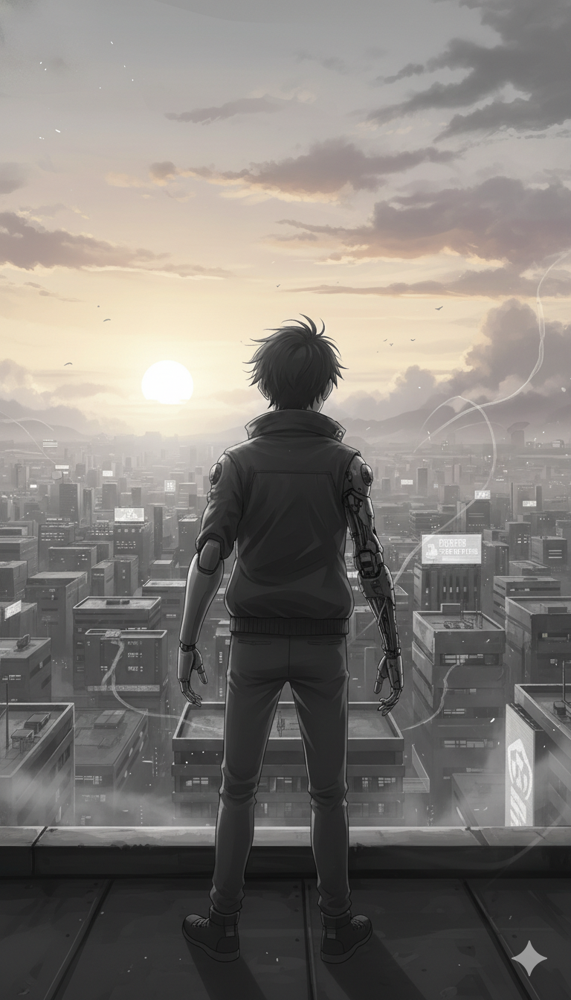

The sun over Neo-Jakarta no longer looked like a dying ember choked by smog. It was a pale, clean gold, casting long shadows over the rubble of the Sovereign Mint Tower. On the steps of the old Kadipiro Mosque, Rix sat quietly, testing his new prosthetics. They were mismatched—one a matte grey composite, the other a recycled industrial strut—but they didn't spark, and they didn't vibrate with the hum of a debt-tracker.

Behind him, the community sanctuary was buzzing with a different kind of energy. The high-frequency transmitters that once broadcasted the terror of sixty missed calls had been repurposed. Now, they beamed local encryption keys for BankZiska, the community-governed ledger where wealth was distributed as Qardhul Hasan—benevolent loans meant to build lives rather than bury them.

"The OJK Satgas PASTI just confirmed the final server wipe of the Mafia Data nodes," Siska said, stepping out into the morning air. She looked tired, but the constant flicker of anxiety and chronic stress that had once defined her expression was gone. "The illegal 'swafotos' and KTP scans Sovereign used for their Sebar Data strikes... they're static now. Burnt code".

Rix flexed his mechanical fingers. "The UU PDP (Personal Data Protection Law) is finally worth more than the paper it was written on," he noted. The "wetvacuum"—the lawless void Sovereign had exploited—was being filled by a new Maqashid Protocol. It was no longer just about regulating money; it was about protecting the soul (ḥifẓ al-nafs) and the dignity of the citizens.

Across the city, the "Social Death" billboards were being torn down or hacked. In their place, the '7 Effective Ways' were displayed as community commandments: Clean your cache. Obfuscate your contacts. Report the predators. Protect your brothers.

Rix pulled a small, battered datapad from his jacket—the one he’d worn since he was a scavenger looking for Kai’s ghost. A single message was pinned to the screen, encrypted with a signature he recognized.

“The ledger is balanced, Rix. Subject K-Prime’s data was the bridge, but your pain was the key. We didn't just delete the debt; we proved it was an illusion. The city belongs to the living now. Don't spend your time looking for me. Spend it being free. – V”.

Rix looked up at the horizon. The legendary Kai was gone, his neural blueprints scattered into the Komdigi Blackhole, and Vera was a shadow in the mesh. But they had left behind something more valuable than Bio-Time. They had left Phantom Equity—the inherent, unpriced value of a human life that no corporation could ever repossess.

For the first time in his life, Rix didn't feel like a Recalled Asset. He didn't feel the burn of Mortal Maag or the crushing weight of Compound Interest. He was just a man with a pair of scavenged arms and a day that belonged entirely to him.

He stood up, the metal of his joints whirring softly, and walked toward the community center to help Siska process the next batch of interest-free loans. The calls had stopped, the debt was dead, and for the people of Neo-Jakarta, the sun was finally rising on a day without interest.

[End of Phantom Equity]